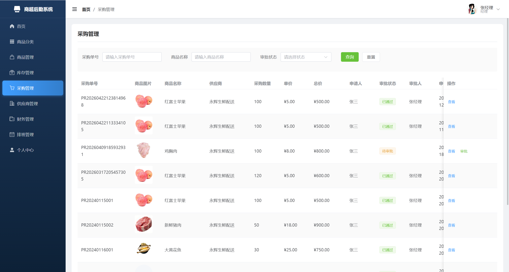
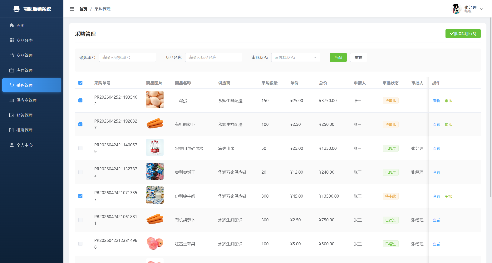
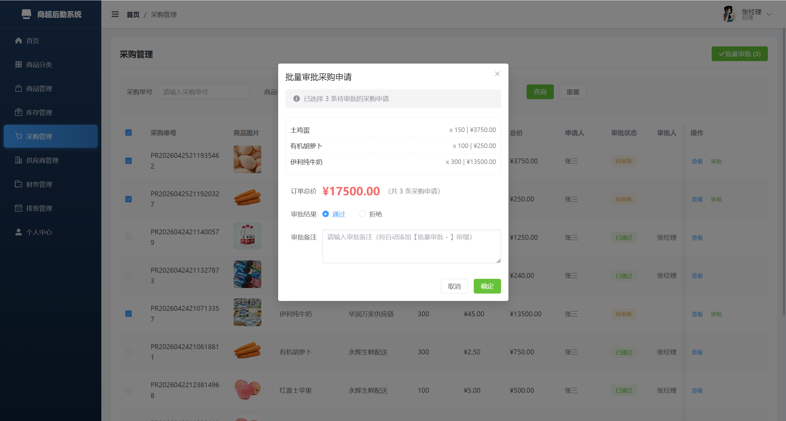
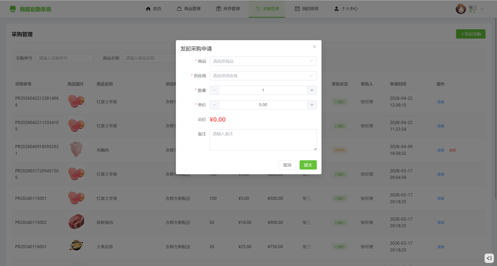
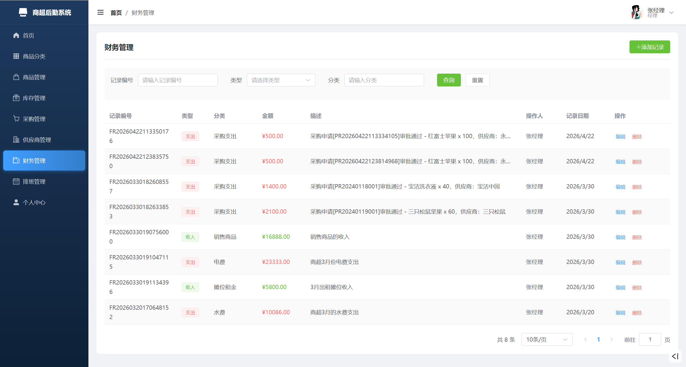
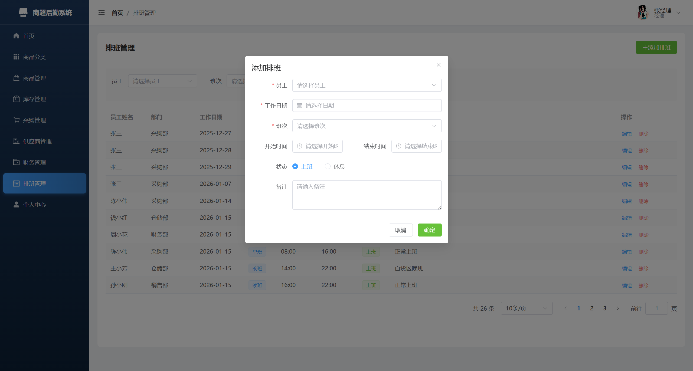
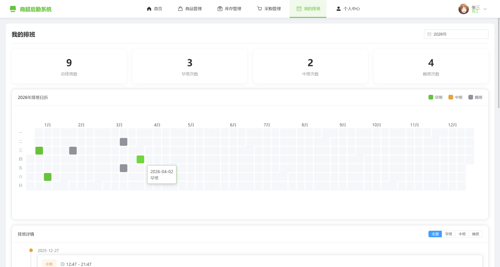

# SLSS - 商超后勤服务管理系统

> Supermarket Logistics Service System

面向商超后勤管理的信息化平台，将商品、库存、采购、财务、排班等核心业务整合到线上处理，帮助商超员工从手工记账和 Excel 表格的繁琐步骤中解放出来，提升管理效率和信息安全性。

---

## 📖 目录

- [项目背景](#-项目背景)
- [系统概述](#-系统概述)
- [功能模块](#-功能模块)
- [技术栈](#-技术栈)
- [项目结构](#-项目结构)
- [环境要求](#-环境要求)
- [快速启动](#-快速启动)
  - [1. 数据库初始化](#1-数据库初始化)
  - [2. 启动后端](#2-启动后端)
  - [3. 启动前端](#3-启动前端)
- [文件存储配置](#-文件存储配置)
- [部署说明](#-部署说明)
- [角色说明](#-角色说明)
- [相关文档](#-相关文档)

---

## 🏪 项目背景

零售行业近几年发展势头良好，市场规模逐年扩大，商超后勤管理的压力随之增长。根据国家统计局数据，2025 年全国社会消费品零售总额达 **501202 亿元**，其中商品零售额高达 **443220 亿元**。

然而，部分中小型商超仍采用传统方式（人工记账、Excel 表格）进行数据归纳，存在效率低下、信息安全隐患等问题。国外大型零售企业（如沃尔玛、家乐福）早在二十年前就开始使用数字化系统，而国内零售业起步较晚，现有的大型 ERP 系统功能复杂且价格昂贵，中小型商超难以负担。

SLSS 正是为解决这些问题而生——致力于为各层次各阶段的商超提供一个**实用、易上手**的信息化管理工具。

---

## 📋 系统概述

- **架构模式**：B/S（浏览器/服务器）架构，前后端分离开发
- **后端框架**：Spring Boot 2.7，MyBatis-Plus 操作 MySQL 数据库
- **前端框架**：Vue 3 单页应用，Element-Plus 组件库，ECharts 图表
- **状态管理**：JWT + Redis 进行 Token 管理
- **文件存储**：对接阿里云 OSS（也可替换为其他云存储或本地存储）
- **角色体系**：超级管理员、经理、员工，不同角色展示不同界面布局

系统包含商品管理、商品分类管理、库存管理、供应商管理、采购管理、财务管理、排班管理等模块，**多个模块间实现业务联动**——例如采购申请审批通过后自动生成财务支出记录。

---

## 🧩 功能模块

| 模块 | 说明 |
|------|------|
| **商品管理** | 商品的增删改查、上下架管理 |
| **商品分类管理** | 两级商品分类维护 |
| **库存管理** | 库存数量查询、预警设置、入库/出库记录 |
| **供应商管理** | 供应商信息维护 |
| **采购管理** | 采购申请提交、审批流程 |
| **财务管理** | 财务收支记录、统计报表 |
| **排班管理** | 员工排班计划制定与查看 |
| **数据统计** | 首页仪表盘，ECharts 可视化展示核心指标 |

### 界面预览















---

## 🛠 技术栈

### 后端

| 技术 | 版本 | 说明 |
|------|------|------|
| JDK | 1.8 | 运行环境 |
| Spring Boot | 2.7.18 | 后端框架 |
| MyBatis-Plus | 3.5.3.1 | ORM 框架，简化数据库操作 |
| MySQL | 8.0.33 | 关系型数据库 |
| Redis | - | Token 黑名单、缓存 |
| JWT (jjwt) | 0.11.5 | 用户认证令牌 |
| PageHelper | 1.4.6 | 分页插件 |
| FastJSON | 2.0.25 | JSON 处理 |
| Hutool | 5.8.18 | 工具集 |
| Lombok | - | 代码简化 |
| 阿里云 OSS SDK | 3.17.4 | 文件云存储 |

### 前端

| 技术 | 版本 | 说明 |
|------|------|------|
| Vue | 3.3.4 | 前端框架 |
| Vite | 5.0.8 | 构建工具 |
| Vue Router | 4.2.5 | 路由管理 |
| Pinia | 2.1.7 | 状态管理 |
| Element Plus | 2.4.3 | UI 组件库 |
| ECharts | 5.4.3 | 数据可视化图表 |
| Axios | 1.6.2 | HTTP 请求库 |
| Sass | 1.69.5 | CSS 预处理器 |

---

## 📁 项目结构

```
SupermarketLogisticsServiceSystem/
├── backend/                          # Spring Boot 后端
│   ├── pom.xml                       # Maven 构建文件
│   └── src/
│       ├── main/
│       │   ├── java/com/supermarket/logistics/
│       │   │   ├── LogisticsApplication.java    # 启动类
│       │   │   ├── common/                      # 通用类（Result、Constants）
│       │   │   ├── config/                      # 配置类（CORS、MyBatis-Plus）
│       │   │   ├── controller/                  # 控制器层
│       │   │   ├── entity/                      # 实体类
│       │   │   ├── mapper/                      # MyBatis Mapper 接口
│       │   │   ├── service/                     # 业务逻辑层
│       │   │   └── utils/                       # 工具类（JWT、OSS、文件上传）
│       │   └── resources/
│       │       ├── application.yml              # 主配置文件
│       │       └── mapper/                      # XML Mapper 文件
│       └── test/
├── frontend/                         # Vue 3 前端
│   ├── package.json
│   ├── vite.config.js                # Vite 配置（含代理设置）
│   └── src/
│       ├── main.js                   # 入口文件
│       ├── App.vue                   # 根组件
│       ├── api/                      # API 接口封装
│       ├── router/                   # 路由配置
│       ├── store/                    # Pinia 状态管理
│       ├── layouts/                  # 布局组件
│       ├── views/                    # 页面组件
│       ├── components/               # 公共组件
│       ├── utils/                    # 工具（Axios 请求封装）
│       └── styles/                   # 全局样式
├── image/                            # README 展示图片
├── supermarket_logistics.sql         # 数据库初始化脚本
└── .gitignore
```

---

## ⚙️ 环境要求

| 依赖 | 版本要求 |
|------|----------|
| JDK | 1.8+ |
| Maven | 3.6+ |
| MySQL | 8.0+ |
| Redis | 任意稳定版本 |
| Node.js | 16+ |
| npm / pnpm | 任意 |

---

## 🚀 快速启动

### 1. 数据库初始化

```sql
-- 创建数据库
CREATE DATABASE supermarket_logistics CHARACTER SET utf8mb4 COLLATE utf8mb4_unicode_ci;

-- 导入表结构和初始数据
mysql -u root -p supermarket_logistics < supermarket_logistics.sql
```

### 2. 启动后端

**方式一（推荐）：IDE 中直接运行**

打开 `backend` 项目，运行启动类：
```
com.supermarket.logistics.LogisticsApplication
```

**方式二：命令行运行**

```bash
cd backend
mvn spring-boot:run
```

**方式三：打包为 JAR 运行**

```bash
cd backend
mvn package -DskipTests
java -jar target/*.jar
```

启动后后端服务运行在 **`http://localhost:8000`**。

> **注意**：启动前请确保 MySQL 和 Redis 服务已启动，并根据实际情况修改 `application.yml` 中的数据库和 Redis 配置。

### 3. 启动前端

```bash
cd frontend
npm install      # 安装依赖（首次运行需要）
npm run dev      # 启动开发服务器
```

启动后前端访问地址：**`http://localhost:9000`**

Vite 已配置代理，前端 `/api` 请求会自动转发到 `http://127.0.0.1:8000`。

---

## ☁️ 文件存储配置

系统默认支持 **阿里云 OSS** 作为文件存储后端，同时也支持本地存储。

### 使用阿里云 OSS

1. 在阿里云控制台创建 **OSS Bucket**（建议区域选择 `cn-beijing`）
2. 创建 **RAM 用户** 并授予 OSS 访问权限，获取 AccessKey
3. 设置环境变量：

```bash
# Windows PowerShell
$env:OSS_ACCESS_KEY_ID = "你的AccessKeyId"
$env:OSS_ACCESS_KEY_SECRET = "你的AccessKeySecret"

# Linux / macOS
export OSS_ACCESS_KEY_ID="你的AccessKeyId"
export OSS_ACCESS_KEY_SECRET="你的AccessKeySecret"
```

4. 根据需要修改 `application.yml` 中的 OSS 配置：

```yaml
aliyun:
  oss:
    enabled: true                     # true 启用 OSS，false 使用本地存储
    endpoint: https://oss-cn-beijing.aliyuncs.com
    bucket-name: your-bucket-name
    region: cn-beijing
```

### 使用其他云存储

如果使用其他云存储服务（如腾讯云 COS、华为云 OBS、七牛云等），参考相关厂商的 SDK 文档，自行实现文件上传接口即可。

### 默认账号

| 角色 | 用户名 | 密码 |
|------|--------|------|
| 超级管理员 | admin | 123456 |
| 经理 | manager | 123456 |
| 员工 | employee | 123456 |

> 首次启动后建议立即修改默认密码。

---

## 🚢 部署说明

### 后端部署

```bash
cd backend
mvn package -DskipTests
# 将 target/*.jar 上传至服务器
java -jar supermarket-logistics.jar --spring.profiles.active=prod &
```

建议创建 `application-prod.yml` 作为生产环境配置，覆盖数据库密码、JWT 密钥等敏感信息。

### 前端部署

```bash
cd frontend
npm run build
# 将 dist/ 目录部署至 Nginx / Caddy 等 Web 服务器
```

**Nginx 配置示例：**

```nginx
server {
    listen 80;
    server_name your-domain.com;

    location / {
        root /path/to/frontend/dist;
        try_files $uri $uri/ /index.html;
    }

    location /api/ {
        proxy_pass http://127.0.0.1:8000/;
        proxy_set_header Host $host;
        proxy_set_header X-Real-IP $remote_addr;
    }
}
```

---

## 👥 角色说明

| 角色 | 说明 | 主要功能 |
|------|------|----------|
| **超级管理员** (role=1) | 系统最高权限，主要用于测试 | 全部功能 |
| **经理** (role=2) | 日常管理操作 | 商品管理、分类管理、库存管理、采购审批、财务管理、排班管理、供应商管理等 |
| **员工** (role=3) | 基础操作权限 | 部分商品管理、采购申请提交、个人排班查看等 |

系统根据登录角色自动展示不同的界面布局：
- **管理员 / 经理** → 左侧导航栏布局（完整菜单）
- **员工** → 顶部导航栏布局（简化菜单）

---

## 📚 相关文档

- [阿里巴巴 Java 开发手册](https://github.com/alibaba/p3c)
- [Spring Boot 官方文档](https://docs.spring.io/spring-boot/docs/2.7.x/reference/html/)
- [Vue 3 官方文档](https://vuejs.org/)
- [Element Plus 官方文档](https://element-plus.org/)
- [MyBatis-Plus 官方文档](https://baomidou.com/)
- [阿里云 OSS 文档](https://help.aliyun.com/product/31815.html)

---

## 📄 许可证

本项目仅供学习交流使用。
